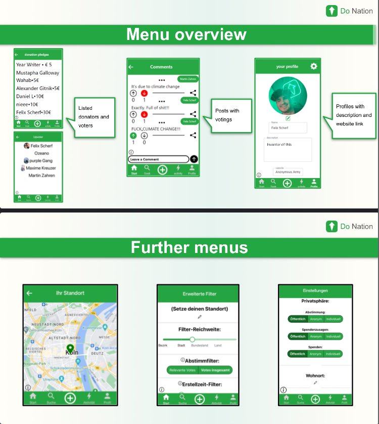

# DoN4t1on

DoN4t1on

## Description

DoN4t1on

## Screenshots



## Technologies Used

- Vite
- React

## Getting Started

### Prerequisites

- Node.js
- npm

### Installation

1. Clone the repository:

```bash
  git clone https://github.com/DoN4t1on/web.git
```

2. Navigate into the project directory:

```bash
  cd project-directory
```

3. Install dependencies:

```bash
  npm install
```

### Development

```bash
  npm run dev
```

### Contributions

Contributions are welcome!
